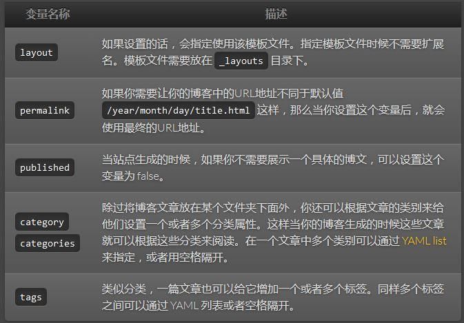

# Jekyll博客搭建

GitHub搭建个人网站可基于jekyll或者hexo或者其它的静态网页生成工具。

GitHub Pages 基于**Jekyll** 构建，使用Jekyll可以快速搭建个人博客。

## 1. Jekyll介绍

> **引用自官网**：
>
> Jekyll 是一个简单的博客形态的静态站点生产机器。它有一个模版目录，其中包含原始文本格式的文档，通过一个转换器（如 [Markdown](https://link.jianshu.com?t=http%3A%2F%2Fdaringfireball.net%2Fprojects%2Fmarkdown%2F)）和我们的 [Liquid](https://link.jianshu.com?t=https%3A%2F%2Fgithub.com%2FShopify%2Fliquid%2Fwiki) 渲染器转化成一个完整的可发布的静态网站，你可以发布在任何你喜爱的服务器上。Jekyll 也可以运行在 [GitHub Page](https://link.jianshu.com?t=http%3A%2F%2Fpages.github.com%2F) 上，也就是说，你可以使用 GitHub 的服务来搭建你的项目页面、博客或者网站，而且是**完全免费**的。

Jekyll + Github Pages可以让我们更加专注于博客内容，而不是考虑如何去搭建一个博客平台。

## 2. Jekyll文件结构

* _config.yml：用于保存配置。（jekyll会自动加载这些配置）

* _includes文件夹：存放可以***重复利用***的文件，可以被其他的文件包含

* _layouts文件夹：存放模板文件

* _posts文件夹：存放实际的博客文章内容（文件名格式：年-月-日-标题.md）

* _site文件夹：存放最终生成的文件（其他的目录都会被拷贝到最终文件的目录下，所以css,images等目录都可以放在根目录下）。

```
.
├──_config.yml
├── _drafts
|   ├── begin-with-the-crazy-ideas.textile
|   └── on-simplicity-in-technology.markdown
├── _includes
|   ├── footer.html
|   └── header.html
├── _layouts
|   ├── default.html
|   └── post.html
├── _posts
|   ├── 2007-10-29-why-every-programmer-should-play-nethack.textile
|   └── 2009-04-26-barcamp-boston-4-roundup.textile
├── _site
├── .jekyll-metadata
└── index.html
```

## 3.Jekll上传文章

写好markdown文档后，以规定的命名格式保存在_post文件下，再上传到github上。

> Tips:
>
>  markdown文档开头可以加上yaml头信息，jekyll就会将其转换成html文件。
>
> yaml头信息中也可以定义自已的变量，比如title，在文中使用的方法：{{ page.title }}

